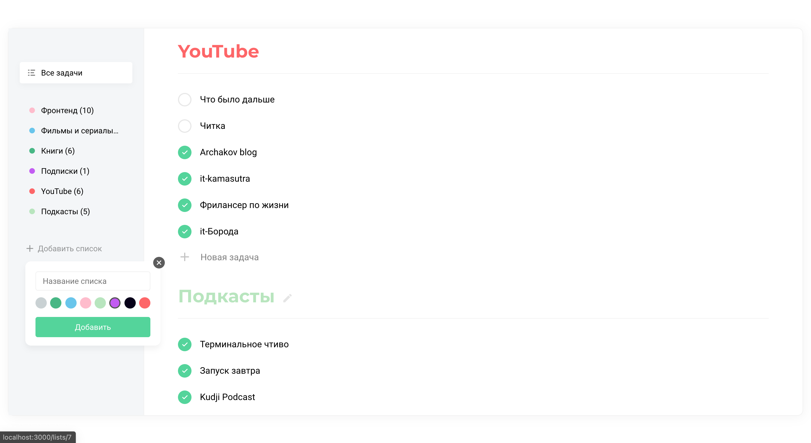
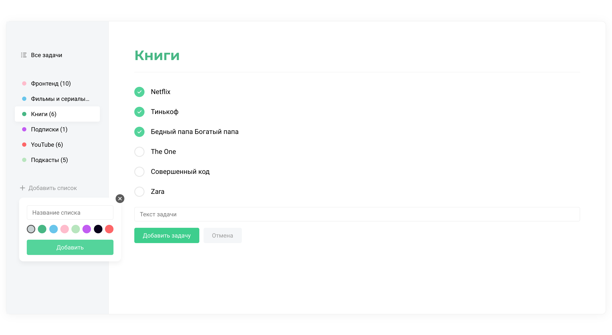
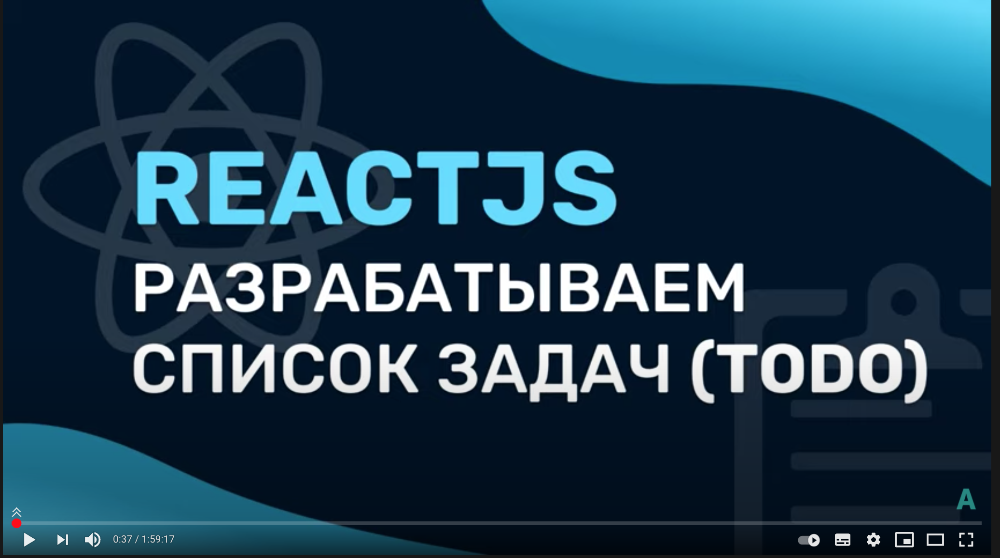

#Разработка списка задача на ReactJS для начинающих

---

**Запустить проект**

```
npm run json-server
npm run start
```




[](https://www.youtube.com/watch?v=PsQC6zOo3FI&list=PL0FGkDGJQjJGBcY_b625HqAKL4i5iNZGs&index=2&t=4s)

`Stack`

```
ReactJS (useState, useReducer, useEffect)
React Router
Axios
classnames
```
